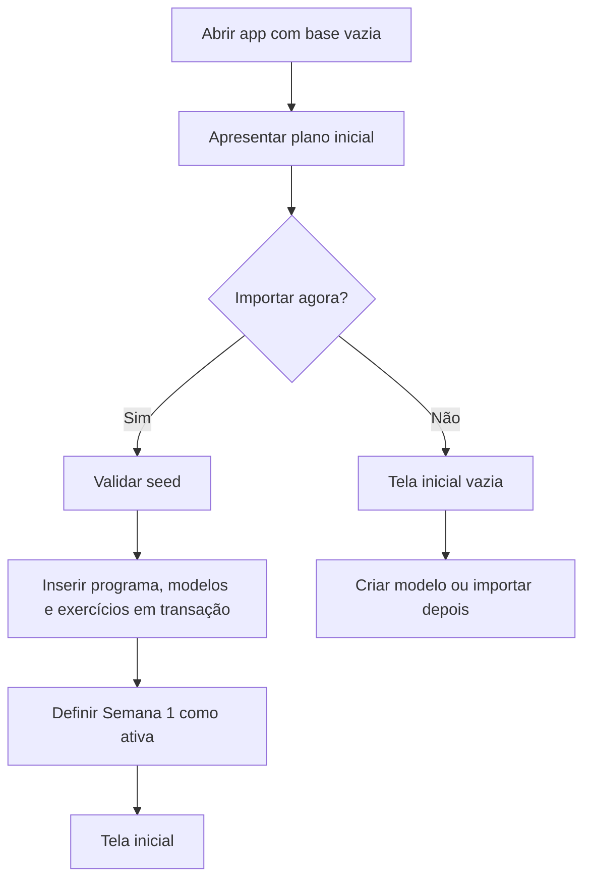
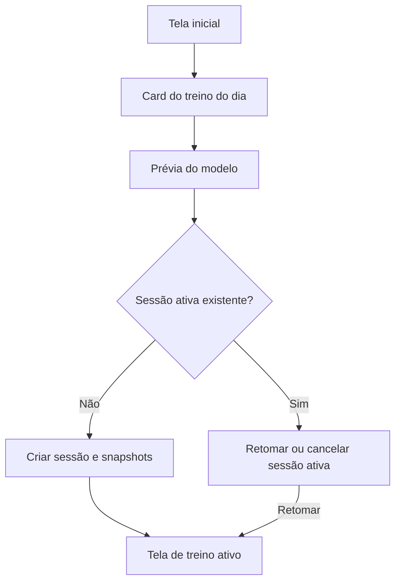
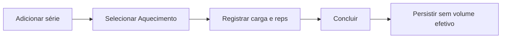
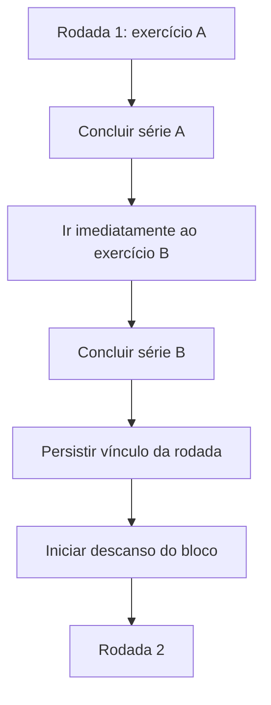
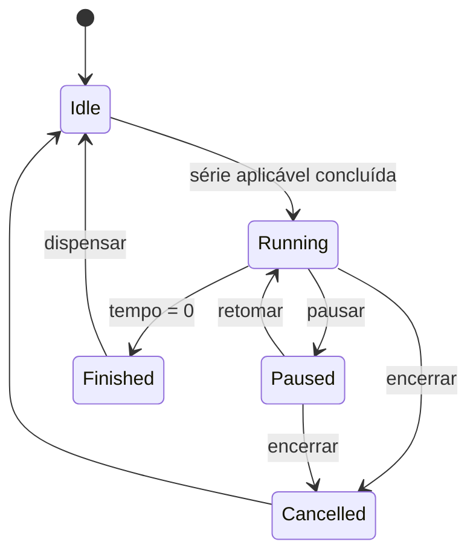
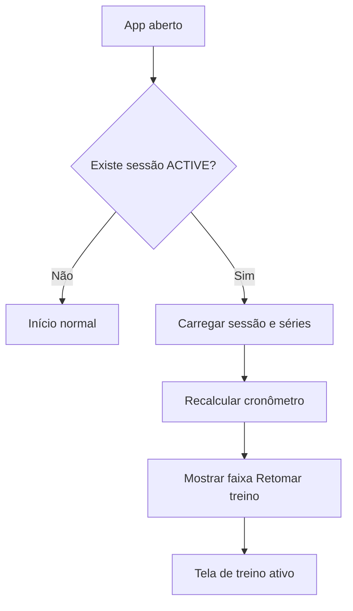
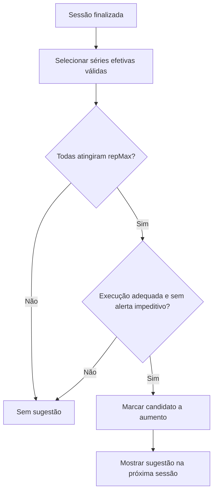

# 04 — Fluxos de Usuário

## 1. Primeiro uso

Regras:

- A importação deve ser transacional.
- Falha não pode deixar dados parciais.
- Importar novamente exige escolha entre cancelar, substituir programa ou criar cópia.

## 2. Iniciar treino previsto

A prévia mostra foco, aquecimento, exercícios, séries e duração aproximada de descanso, sem exigir confirmação de cada item.

## 3. Registrar série comum

1. Abrir o exercício atual.
2. App sugere carga e repetições da série anterior ou último histórico.
3. Ajustar com controles `−` e `+`.
4. Opcionalmente informar RIR, técnica e observação.
5. Tocar em **Concluir série**.
6. Persistir série.
7. Iniciar descanso, quando aplicável.
8. Preparar próxima série com valores copiados.

Falhas de persistência devem manter os valores na tela e apresentar ação de tentar novamente.

## 4. Série de aquecimento

O app não deve consumir automaticamente uma das séries efetivas planejadas.

## 5. Exercício unilateral

1. O exercício abre com modo “mesmo valor nos dois lados”.
2. Usuário registra carga e repetições uma vez.
3. O app replica para esquerda e direita.
4. Usuário pode desativar o vínculo.
5. Campos de cada lado tornam-se independentes.
6. A conclusão exige pelo menos um valor válido para cada lado, salvo série marcada como interrompida.

## 6. Supersérie

- Não iniciar descanso entre A e B.
- Se B for pulado, solicitar motivo e permitir encerrar a rodada de forma incompleta.
- A contagem muscular permanece separada por exercício.

## 7. Técnica intensificadora

1. Usuário seleciona `Drop set` ou `Rest-pause`.
2. App verifica se já existe técnica intensificadora na sessão.
3. App verifica se é a última série prevista do exercício.
4. Se houver violação, mostrar aviso com explicação.
5. Usuário pode voltar ou confirmar exceção.
6. A série recebe técnica e flag de exceção quando aplicável.

## 8. Descanso

- O estado persiste `deadline`, duração original e ajustes.
- A UI calcula o restante a partir do relógio monotônico.
- Ao voltar do segundo plano, recalcula; não decrementa um contador persistido cegamente.

## 9. Equipamento indisponível

1. Abrir menu do exercício.
2. Escolher **Substituir nesta sessão**.
3. Pesquisar exercício existente ou criar temporário.
4. Informar motivo opcional.
5. Preservar posição, faixa e bloco quando compatíveis.
6. Registrar referência ao exercício planejado e ao executado.
7. Não alterar modelo sem ação separada.

## 10. Recuperar sessão

## 11. Finalizar sessão

1. Tocar em **Finalizar treino**.
2. App verifica exercícios incompletos e cronômetro ativo.
3. Mostrar resumo preliminar.
4. Usuário confirma.
5. Encerrar cronômetro.
6. Gravar `finishedAt` e status `COMPLETED` em transação.
7. Calcular resumo derivado.
8. Exibir progressões candidatas e observações pendentes.

## 12. Progressão

A sugestão nunca altera a carga automaticamente.

## 13. Backup e restauração

### Exportar

1. Abrir Configurações > Dados.
2. Selecionar **Exportar backup**.
3. Gerar payload em memória/arquivo temporário.
4. Abrir seletor de destino do Android.
5. Salvar JSON com data e versão.
6. Confirmar sucesso.

### Restaurar

1. Selecionar arquivo pelo seletor do Android.
2. Validar formato, versão, tamanho e referências.
3. Mostrar resumo do conteúdo.
4. Criar backup preventivo opcional da base atual.
5. Restaurar em transação.
6. Reabrir repositórios e validar contagens.
7. Em erro, manter base anterior intacta.
