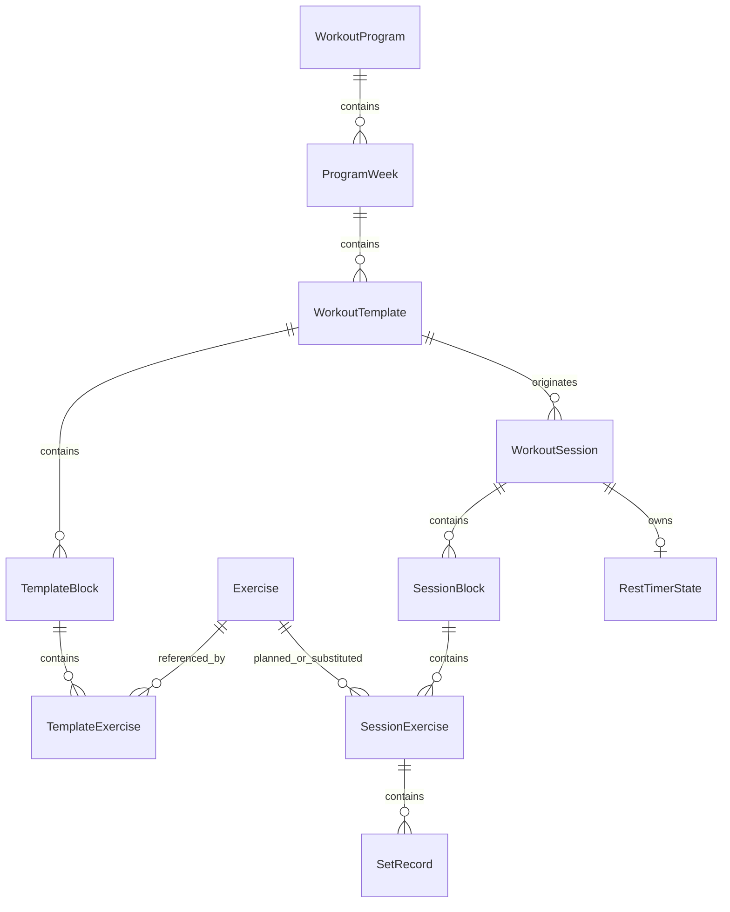

# 06 — Modelo de Dados

## 1. Princípios

- Identificadores UUID em texto para facilitar backup e merge futuro.
- Entidades históricas preservam snapshots.
- Exclusão lógica para catálogo e modelos.
- Datas civis em epoch milliseconds UTC.
- Carga persistida em gramas inteiras para evitar erro decimal.
- Ordenação por campos explícitos.
- Enums persistidos como strings por conversores versionados.
- Operações críticas em transação.

## 2. Diagrama conceitual



## 3. Entidades

### 3.1 ExerciseEntity

| Campo | Tipo | Regra |
|---|---|---|
| id | String | UUID, PK |
| canonicalName | String | obrigatório, nome exibido |
| normalizedName | String | índice de busca |
| aliasesJson | String | lista pequena serializada ou tabela futura |
| primaryMuscleGroup | String | enum |
| secondaryMuscleGroupsJson | String | opcional |
| equipmentType | String | enum |
| laterality | String | `BILATERAL`, `PER_SIDE`, `ALTERNATING` |
| measurementType | String | `WEIGHT_REPS` no MVP |
| defaultLoadIncrementGrams | Long | >= 0 |
| notes | String? | opcional |
| isArchived | Boolean | default false |
| createdAtEpochMs | Long | obrigatório |
| updatedAtEpochMs | Long | obrigatório |

Índices: `normalizedName`, `primaryMuscleGroup`, `isArchived`.

### 3.2 WorkoutProgramEntity

| Campo | Tipo | Regra |
|---|---|---|
| id | String | UUID, PK |
| name | String | obrigatório |
| description | String? | opcional |
| cycleLengthWeeks | Int | >= 1; seed = 2 |
| activeWeekOrdinal | Int | 1..cycleLengthWeeks |
| isActive | Boolean | apenas um ativo no MVP |
| sourceSeedVersion | String? | rastreabilidade |
| isArchived | Boolean | default false |
| createdAtEpochMs | Long | obrigatório |
| updatedAtEpochMs | Long | obrigatório |

### 3.3 ProgramWeekEntity

| Campo | Tipo | Regra |
|---|---|---|
| id | String | UUID, PK |
| programId | String | FK |
| ordinal | Int | único por programa |
| name | String | ex.: Semana 1 |
| notes | String? | opcional |

Restrição única: `(programId, ordinal)`.

### 3.4 WorkoutTemplateEntity

| Campo | Tipo | Regra |
|---|---|---|
| id | String | UUID, PK |
| programWeekId | String? | FK; nulo para modelo avulso |
| name | String | obrigatório |
| weekday | Int? | ISO 1..7 |
| focus | String? | ênfase |
| warmupNotes | String? | texto estruturado simples |
| orderIndex | Int | ordenação |
| isArchived | Boolean | default false |
| createdAtEpochMs | Long | obrigatório |
| updatedAtEpochMs | Long | obrigatório |

### 3.5 TemplateBlockEntity

| Campo | Tipo | Regra |
|---|---|---|
| id | String | UUID, PK |
| templateId | String | FK |
| blockType | String | `STANDARD`, `SUPERSET` |
| title | String? | ex.: Supersérie 1 |
| plannedRounds | Int | >= 1 |
| orderIndex | Int | único lógico por template |
| restMinSeconds | Int? | >= 0 |
| restMaxSeconds | Int? | >= min |
| defaultRestSeconds | Int? | dentro da faixa |
| notes | String? | opcional |

### 3.6 TemplateExerciseEntity

| Campo | Tipo | Regra |
|---|---|---|
| id | String | UUID, PK |
| blockId | String | FK |
| exerciseId | String | FK |
| orderInBlock | Int | >= 0 |
| plannedEffectiveSets | Int | >= 1 |
| repMin | Int | >= 1 |
| repMax | Int | >= repMin |
| repsPerSide | Boolean | derivável, snapshot explícito |
| restMinSeconds | Int? | override para bloco normal |
| restMaxSeconds | Int? | override |
| defaultRestSeconds | Int? | override |
| allowedTechnique | String | `NONE`, `DROP_SET`, `REST_PAUSE` |
| techniqueLastSetOnly | Boolean | default true quando técnica existe |
| notes | String? | equipamento, pegada, amplitude |

### 3.7 WorkoutSessionEntity

| Campo | Tipo | Regra |
|---|---|---|
| id | String | UUID, PK |
| sourceTemplateId | String? | referência opcional |
| programIdSnapshot | String? | rastreabilidade |
| programWeekOrdinalSnapshot | Int? | semana executada |
| nameSnapshot | String | obrigatório |
| focusSnapshot | String? | opcional |
| status | String | `ACTIVE`, `COMPLETED`, `CANCELLED` |
| startedAtEpochMs | Long | obrigatório |
| finishedAtEpochMs | Long? | conforme status |
| generalNotes | String? | opcional |
| wasEditedAfterCompletion | Boolean | default false |
| createdAtEpochMs | Long | obrigatório |
| updatedAtEpochMs | Long | obrigatório |

Índice único parcial deve ser simulado por transação/regra para apenas uma sessão `ACTIVE`.

### 3.8 SessionBlockEntity

Snapshot do bloco usado na sessão.

| Campo | Tipo | Regra |
|---|---|---|
| id | String | UUID, PK |
| sessionId | String | FK |
| sourceBlockId | String? | referência opcional |
| blockTypeSnapshot | String | `STANDARD`, `SUPERSET` |
| titleSnapshot | String? | opcional |
| plannedRoundsSnapshot | Int | >= 1 |
| orderIndex | Int | ordenação atual da sessão |
| restMinSecondsSnapshot | Int? | opcional |
| restMaxSecondsSnapshot | Int? | opcional |
| defaultRestSecondsSnapshot | Int? | opcional |
| notesSnapshot | String? | opcional |

### 3.9 SessionExerciseEntity

| Campo | Tipo | Regra |
|---|---|---|
| id | String | UUID, PK |
| sessionBlockId | String | FK |
| plannedExerciseId | String? | exercício previsto |
| performedExerciseId | String | exercício executado |
| nameSnapshot | String | obrigatório |
| equipmentSnapshot | String? | opcional |
| lateralitySnapshot | String | enum |
| plannedEffectiveSetsSnapshot | Int | >= 1 |
| repMinSnapshot | Int | >= 1 |
| repMaxSnapshot | Int | >= repMin |
| allowedTechniqueSnapshot | String | enum |
| orderInBlock | Int | ordenação |
| substitutionReason | String? | se trocado |
| sessionNotes | String? | opcional |
| status | String | `PENDING`, `IN_PROGRESS`, `COMPLETED`, `SKIPPED` |

### 3.10 SetRecordEntity

| Campo | Tipo | Regra |
|---|---|---|
| id | String | UUID, PK |
| sessionExerciseId | String | FK |
| setOrder | Int | ordenação exibida |
| roundIndex | Int? | rodada da supersérie |
| setType | String | `WARMUP`, `EFFECTIVE` |
| loadGrams | Long? | carga bilateral ou compartilhada |
| reps | Int? | bilateral |
| leftLoadGrams | Long? | por lado |
| leftReps | Int? | por lado |
| rightLoadGrams | Long? | por lado |
| rightReps | Int? | por lado |
| rir | Double? | 0..10, passo de UI sugerido 0.5 |
| technique | String | `NONE`, `DROP_SET`, `REST_PAUSE` |
| techniqueExceptionConfirmed | Boolean | default false |
| executionFlagsJson | String | lista: dor, parcial, instável etc. |
| notes | String? | opcional |
| status | String | `DRAFT`, `COMPLETED`, `INTERRUPTED` |
| completedAtEpochMs | Long? | conforme status |
| createdAtEpochMs | Long | obrigatório |
| updatedAtEpochMs | Long | obrigatório |

Restrição lógica: `(sessionExerciseId, setOrder)` único.

### 3.11 RestTimerStateEntity

| Campo | Tipo | Regra |
|---|---|---|
| sessionId | String | PK e FK |
| state | String | `IDLE`, `RUNNING`, `PAUSED`, `FINISHED` |
| sourceSetId | String? | série que iniciou |
| sourceBlockId | String? | bloco aplicável |
| originalDurationSeconds | Int | >= 0 |
| adjustedDurationSeconds | Int | >= 0 |
| targetElapsedRealtimeMs | Long? | relógio monotônico |
| targetEpochMs | Long? | fallback após reinício |
| pausedRemainingMs | Long? | quando pausado |
| updatedAtEpochMs | Long | auditoria |

### 3.12 AppSettings

Persistido em Preferences DataStore, não em Room.

- unitSystem: `METRIC`.
- defaultLoadIncrementGrams.
- defaultRestSeconds.
- autoStartRest.
- soundEnabled.
- vibrationEnabled.
- keepScreenOnDuringWorkout.
- themeMode.
- confirmFinishWithIncompleteExercises.
- lastSelectedProgramId.

## 4. Modelos de domínio derivados

- `ActiveWorkout`: sessão completa, blocos, exercícios, séries e timer.
- `ExerciseHistoryEntry`: série histórica com snapshot e contexto.
- `ProgressionCandidate`: carga anterior, incremento e justificativa.
- `WorkoutSummary`: duração, séries efetivas, volume e flags.
- `SetInput`: estado editável não persistido até criação de draft ou conclusão.

## 5. Conversões

- UI em kg: `grams / 1000.0`.
- Entrada decimal: converter para gramas com arredondamento validado.
- Datas: armazenar UTC e formatar no fuso local.
- Enums desconhecidos em backup futuro devem falhar com mensagem clara ou usar estratégia de compatibilidade explicitamente versionada.

## 6. Política de snapshots

Ao iniciar sessão, copiar para entidades de sessão:

- nome e equipamento do exercício;
- lateralidade;
- faixa de repetições;
- séries planejadas;
- regra de técnica;
- foco e nome do treino;
- configuração do bloco e descanso.

O histórico pode continuar referenciando o catálogo, mas a exibição principal usa o snapshot.

## 7. Exclusão

- Programa, modelo e exercício: arquivamento lógico.
- Sessão: cancelamento ou exclusão explícita com confirmação.
- Série: exclusão física permitida dentro da sessão, desde que resumos sejam recalculados.
- Cascata de banco deve ser usada apenas onde não apaga histórico por acidente.

## 8. Migrações

- Toda mudança de schema incrementa a versão do banco.
- `fallbackToDestructiveMigration` é proibido em builds que contenham dados reais.
- Cada migração possui teste partindo da versão anterior suportada.
- Backup JSON possui versão independente da versão Room.
- Mudanças incompatíveis exigem migrador de importação.

## 9. Formato de backup

```json
{
  "backupSchemaVersion": 1,
  "exportedAt": "2026-07-17T13:00:00Z",
  "appVersion": "0.1.0",
  "programs": [],
  "weeks": [],
  "templates": [],
  "templateBlocks": [],
  "templateExercises": [],
  "exercises": [],
  "sessions": [],
  "sessionBlocks": [],
  "sessionExercises": [],
  "sets": [],
  "settings": {}
}
```

## 10. Consultas críticas

- Obter sessão ativa completa.
- Obter treino do dia pela semana ativa.
- Obter último desempenho concluído por exercício.
- Obter histórico paginado por exercício.
- Contar técnicas intensificadoras da sessão.
- Obter séries efetivas válidas para progressão.
- Exportar grafo completo com ordem determinística.
